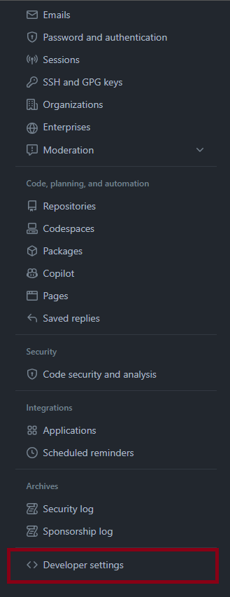
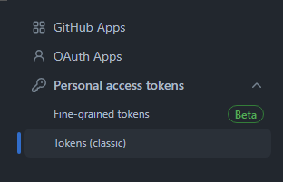
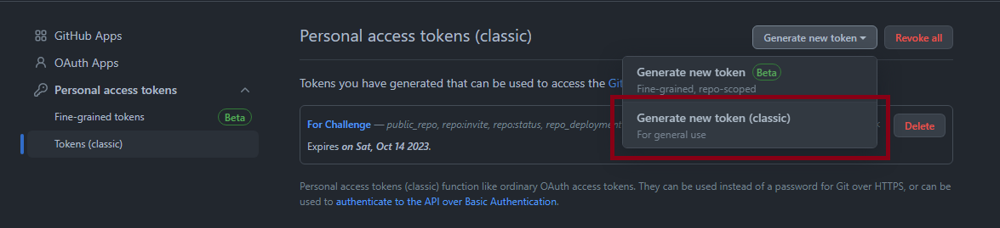

# Prerequisites

- A GitHub account. If you don't have one, you can sign up for free at [GitHub](https://github.com/join).
- A GitHub account token.


# Steps

## Github User Access Token

1. **Login to Your GitHub Account**

   Open your web browser and navigate to [GitHub](https://github.com/). If you are not already logged in, sign in with your GitHub username and password.

2. **Access Your Account Settings**

   Click on your profile picture in the top-right corner of the GitHub homepage, then select "Settings" from the dropdown menu.


3. **Access Developer Settings**

   In the left sidebar, click on "Developer settings."

   

4. **Access Personal Access Tokens**

   In the left sidebar of the Developer settings, click on "Personal access tokens." and then "Tokens (classic)"

   

5. **Generate a New Token**

   Click the "Generate token" button.

   

6. **Configure Your Token**

   - Provide a name for your token in the "Token name" field. Choose a descriptive name to remember its purpose.
   - Select the desired permissions for your token. For this application you will only need the "repo" permissions.
   - Optionally, set an expiration for the token if needed, you can always revoke it later at any time as explained below.
   - Click the "Generate token" button at the bottom of the page.

   <br>

7. **Copy Your Token**

   After generating the token, you will see a success message, and the token itself will be displayed. **Make sure to copy the token immediately**, as it will not be shown again for security reasons. Store it securely.

   You will be using it on the next section

   

<!-- 8. **Using Your Token**

    

   In the root of the project create a ".env" file, and inside put this code, replacing YOUR-TOKEN with the token you copied in the last step:
   ```javascript
   NEXT_PUBLIC_GH_TOKEN="YOUR-TOKEN" -->

## Starting the project

1. **Clone the repository**

2. **Create environment variable**

    In the root of the project create a ".env" file, and inside put this code, replacing YOUR-TOKEN with the token you copied in the last step:
   ```javascript
   NEXT_PUBLIC_GH_TOKEN="YOUR-TOKEN"
    ```

3. **Run npm install**

    Run "npm install" while on the root directory of the project

4. **Start the development server**

    Run "npm run dev" on the console to start the server, it will normally be hosted on "localhost:3000", if not, refer to the console for the correct URL.

5. **Go test!**


    <br>
## Revoking or Regenerating Your Token

You can always revoke or regenerate your access token by visiting the "Personal access tokens" section in your GitHub settings and managing your existing tokens.

